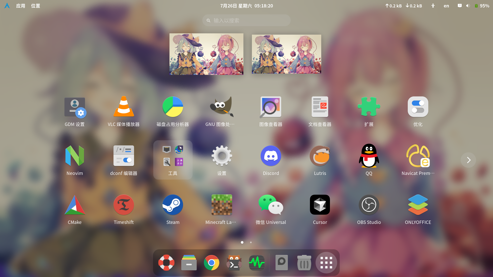
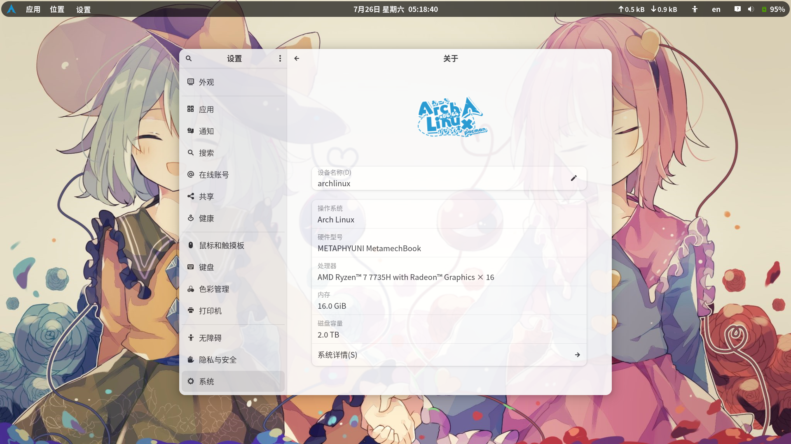
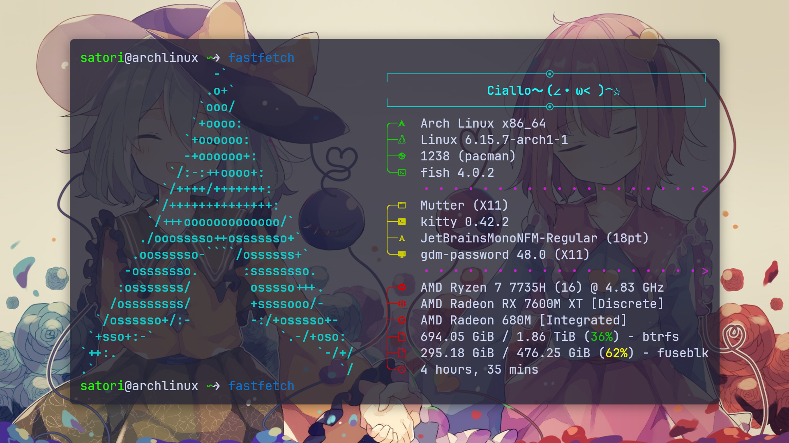

### Arch Linux + GNOME 初始化脚本

⚠️ **待优化/待处理**
- Dconf (分层结构化)
- Fluent theme (待移除)
- GNOME Extensions (需要更新)
- Google Chrome (迁移至Zen Browser)
- Xorg (迁移至Wayland)

🎨 **安装/初始化**
```
./init.sh
```

📖 **桌面展示**







